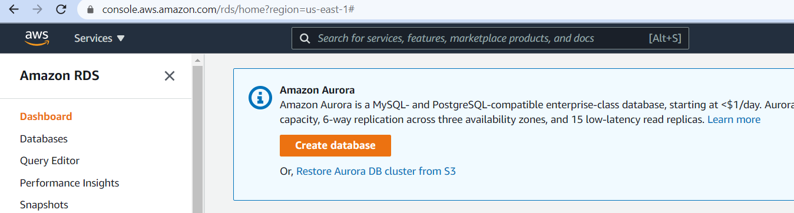
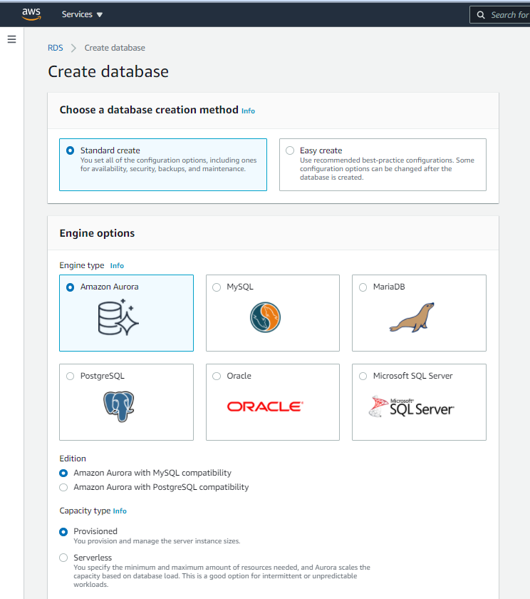
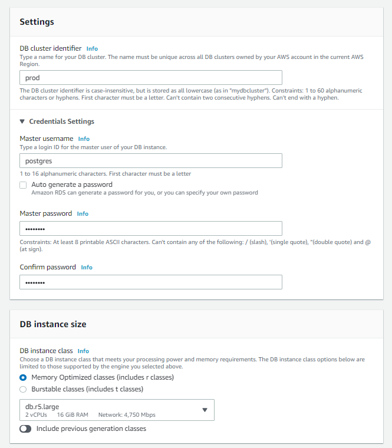
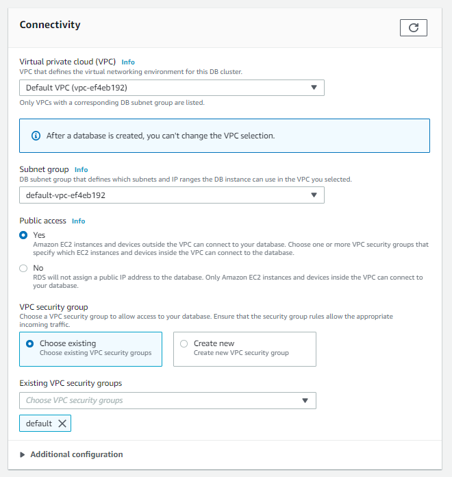
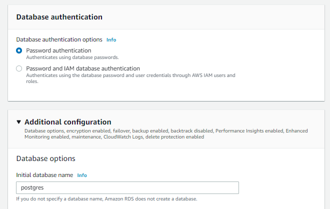
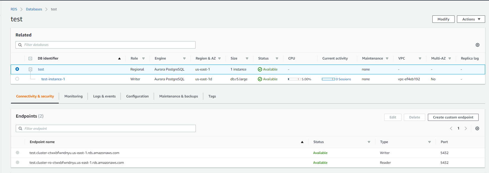
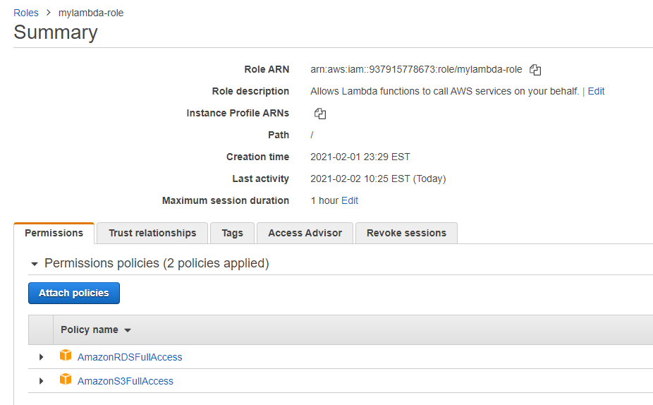

# AWS Lambda to update RDS from S3 
AWS Lambda function that updates a Postgresql RDS using CSV data from a S3 bucket

## Environment

- S3 bucket contains a CSV file
- RDS Cluster running Postgresql
- AWS Lambda
- Local Ubuntu instance

## Creating your RDS Postgresql DB on AWS

*Login to your AWS Console, select RDS and Create Database*



<hr>

*Choose the Standard Create option and select Amazon Aurora along with PostgreSQL compatibility*



<hr>

*Name your RDS instance and set your username and password*



<hr>

*Important! Set your RDS up for public access and note the VPC Security Group. You will need to adjust this security group to allow incoming traffic to port 5432 from your local Ubuntu Instance*



<hr>

*Under Additional Configuration, create your database name*



<hr>

*Done! Once the databases are up, you can access them using their endpoint name*




## Create an IAM Role to be used by our Lambda function

The IAM Role needs to have full access to:
- S3
- RDS

Note the ARN since, we will need to use this later when deploying the Lambda function from the AWS CLI



## Preparing your local Ubuntu instance

We use a local Ubuntu instance to do the following:
    - To package your Lambda function
    - To connect to remote RDS and create a table

#### Install pre-requisites

```
$sudo apt-get update && install -y python3-pip postgresql-client awscli 
# Copy your AWS client ID and Secret to ~/.aws/credentials
```

#### Run AWS configure to set your region

AWS configure automatically picks up your keys from ~/.aws/credentials. You just need to set the region when it prompts you to.
For example, we set it here to us-east-1, this is where we had created our RDS database too.

```
$sudo aws configure
Default region name [None]:us-east-1
```

## On your Ubuntu Instance: Create an S3 bucket and copy your CSV file

```
$sudo aws mb s3://mytest-bucket
$sudo aws cp Data.csv s3://mytest-bucket
```

## On your Ubuntu Instance: Create your AWS RDS table with the required fields

```
$psql -h prod.xxxxxxx.amazonaws.com -U postgres
postgres=> CREATE TABLE Tasks (TaskID serial primary key, VIN varchar(17), 
HoldNumber varchar(255), Description varchar(255), Location varchar(255), 
Bay varchar(255), DateTime TIMESTAMPTZ, UserName varchar(255), 
VehicleScan boolean, VehicleScanLink varchar(255), Issue varchar(255));
postgres=> \d
                List of relations
 Schema |       Name       |   Type   |  Owner
--------+------------------+----------+----------
 public | tasks            | table    | postgres
```

## On your Ubuntu Instance: Create and package your Lambda function

```
$mkdir lambda
$cd lambda

#Your app.py will be the main file and it should have an entry point handler defined as follows:
def lambda_handler(event, context):
    ...
    ...

# We don't use pymysql since it hangs or times out during connect
# Also, pip3 install psycopg2 does not build right for lambda
# We use psycopg2 from https://github.com/jkehler/awslambda-psycopg2
# copy the psycopg2-3.6 directory from the above repo and rename it as psycopg2

$wget https://github.com/jkehler/awslambda-psycopg2/tree/master/psycopg2-3.6
$mv psycopg2-3.6 psycopg2
$zip -r csv_to_rds.zip *

# Create and call the AWS create-function with the IAM Role
$sudo aws lambda create-function --function-name csv-to-rds --zip-file fileb://csv_to_rds.zip \
--role arn:aws:iam::937915778673:role/mylambda-role --handler app.lambda_handler --runtime python3.6
$sudo aws lambda invoke --invocation-type RequestResponse --function-name csv-to-rds outfile

```

