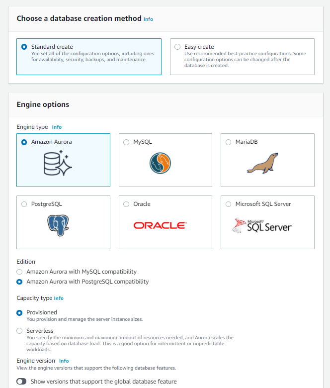

# AWS Lambda to update RDS from S3 
AWS Lambda function that updates a Postgresql RDS using CSV data from a S3 bucket

## Environment

- S3 bucket contains a CSV file
- RDS Cluster running Postgresql
- AWS Lambda
- Local Ubuntu instance

## Creating your RDS Postgresql DB on AWS

*Login to your AWS Console, select RDS and Create Database*

*Choose the Standard Create option and select Amazon Aurora along with PostgreSQL compatibility*

*Name your RDS instance and set your username and password*

*Important! Set your RDS up for public access and note the VPC Security Group. You will need to adjust this security group to allow incoming traffic to port 5432 from your local Ubuntu Instance*

*Under Additional Configuration, create your database name*

*Done! Once the databases are up, you can access them using their endpoint name.

## Preparing your local Ubuntu instance

We use a lical Ubuntu instance to do the following:
    - To package your Lambda function
    - To connect to remote RDS and create a table

### 
